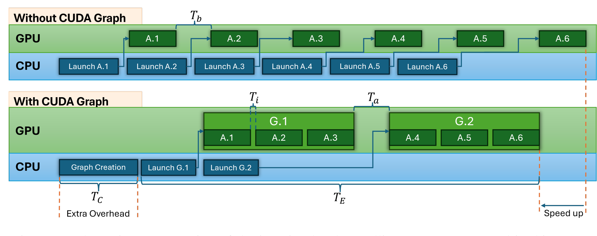

### Enabling CUDA graph



Make kernel implmentation static.

1. fixed batch size 
2. fixed memory access pattern (**No CudaMalloc**)
you should not create tensors

https://zhuanlan.zhihu.com/p/700224642


performance boost: 30 token/s $\Rightarrow$ 130 token/s

#### Major discrepancy: Management of metadata

1. complicated calling/inheritance relationship

2. what to pass? (Seqs)

option1: qwen3.py module.forward(seqs)
option2: a single backend, managed by model_runner.py

#### Questions

1. How does sglang's fast_decode_plan speed-up metadata preparation for flashinfer

Think about missed metadata.
https://docs.flashinfer.ai/tutorials/kv_layout.html#page-table-layout

```python

def fast_decode_plan(
    self,
    indptr: torch.Tensor,
    indices: torch.Tensor,
    last_page_len: torch.Tensor,
    num_qo_heads: int,
    num_kv_heads: int,
    head_dim: int,
    page_size: int,
    pos_encoding_mode: str = "NONE",
    window_left: int = -1,
    logits_soft_cap: Optional[float] = None,
    q_data_type: Optional[Union[str, torch.dtype]] = None,
    kv_data_type: Optional[Union[str, torch.dtype]] = None,
    data_type: Optional[Union[str, torch.dtype]] = None,
    sm_scale: Optional[float] = None,
    rope_scale: Optional[float] = None,
    rope_theta: Optional[float] = None,
    non_blocking: bool = True,
) -> None:
    """
    A faster version of BatchDecodeWithPagedKVCacheWrapper::plan used for FlashInferMultiStepDraftBackend.
    Modifications:
    - Remove unnecessary device-to-device copy for the cuda graph buffers.
    - Remove unnecessary host-to-device copy for the metadata buffers.
    """
    batch_size = len(last_page_len)
    if logits_soft_cap is None:
        logits_soft_cap = 0.0

    # Handle data types consistently
    if data_type is not None:
        if q_data_type is None:
            q_data_type = data_type
        if kv_data_type is None:
            kv_data_type = data_type
    elif q_data_type is None:
        q_data_type = "float16"

    if kv_data_type is None:
        kv_data_type = q_data_type

    if self.use_tensor_cores:
        qo_indptr_host = _get_range_buf(batch_size + 1, "cpu")

    if self.is_cuda_graph_enabled:
        if batch_size != self._fixed_batch_size:
            raise ValueError(
                "The batch size should be fixed in cudagraph mode, the runtime batch size {} "
                " mismatches the batch size set during initialization {}".format(
                    batch_size, self._fixed_batch_size
                )
            )
        if len(indices) > len(self._paged_kv_indices_buf):
            raise ValueError(
                "The size of indices should be less than or equal to the allocated buffer"
            )
    else:
        self._paged_kv_indptr_buf = indptr
        self._paged_kv_indices_buf = indices
        self._paged_kv_last_page_len_buf = last_page_len
        if self.use_tensor_cores:
            self._qo_indptr_buf = qo_indptr_host.to(
                self.device, non_blocking=non_blocking
            )

    # Create empty tensors for dtype info if needed
    empty_q_data = torch.empty(
        0,
        dtype=(
            getattr(torch, q_data_type) if isinstance(q_data_type, str) else q_data_type
        ),
        device=self.device,
    )

    empty_kv_cache = torch.empty(
        0,
        dtype=(
            getattr(torch, kv_data_type)
            if isinstance(kv_data_type, str)
            else kv_data_type
        ),
        device=self.device,
    )

    indptr_host = (
        global_override_indptr_cpu
        if global_override_indptr_cpu is not None
        else indptr.cpu()
    )

    with torch.cuda.device(self.device):

        if self.use_tensor_cores:
            # ALSO convert last_page_len to CPU
            if page_size == 1:
                # When page size is 1, last_page_len is always 1.
                # Directly construct the host tensor rather than executing a device-to-host copy.
                last_page_len_host = torch.ones(
                    (batch_size,), dtype=torch.int32, device="cpu"
                )
            else:
                last_page_len_host = last_page_len.cpu()

            kv_lens_arr_host = get_seq_lens(indptr_host, last_page_len_host, page_size)

            try:
                # Make sure we pass exactly 15 arguments for tensor core version
                self._plan_info = self._cached_module.plan(
                    self._float_workspace_buffer,
                    self._int_workspace_buffer,
                    self._pin_memory_int_workspace_buffer,
                    qo_indptr_host,
                    indptr_host,
                    kv_lens_arr_host,
                    batch_size,  # total_num_rows
                    batch_size,
                    num_qo_heads,
                    num_kv_heads,
                    page_size,
                    self.is_cuda_graph_enabled,
                    head_dim,
                    head_dim,
                    False,  # causal
                )
            except Exception as e:
                raise RuntimeError(f"Error in standard plan: {e}")
        else:
            try:
                # Make sure we pass exactly 15 arguments for standard version
                self._plan_info = self._cached_module.plan(
                    self._float_workspace_buffer,
                    self._int_workspace_buffer,
                    self._pin_memory_int_workspace_buffer,
                    indptr_host,
                    batch_size,
                    num_qo_heads,
                    num_kv_heads,
                    page_size,
                    self.is_cuda_graph_enabled,
                    window_left,
                    logits_soft_cap,
                    head_dim,
                    head_dim,
                    empty_q_data,
                    empty_kv_cache,
                )
            except Exception as e:
                raise RuntimeError(f"Error in standard plan: {e}")

    self._pos_encoding_mode = pos_encoding_mode
    self._window_left = window_left
    self._logits_soft_cap = logits_soft_cap
    self._sm_scale = sm_scale
    self._rope_scale = rope_scale
    self._rope_theta = rope_theta

```
2. Why the current code does not have bugs?

There is only one single layer of kcache/vcache item for attention backend.
When cuda graph is enabled, why there are multiple physical positions of kcache/vcache.
