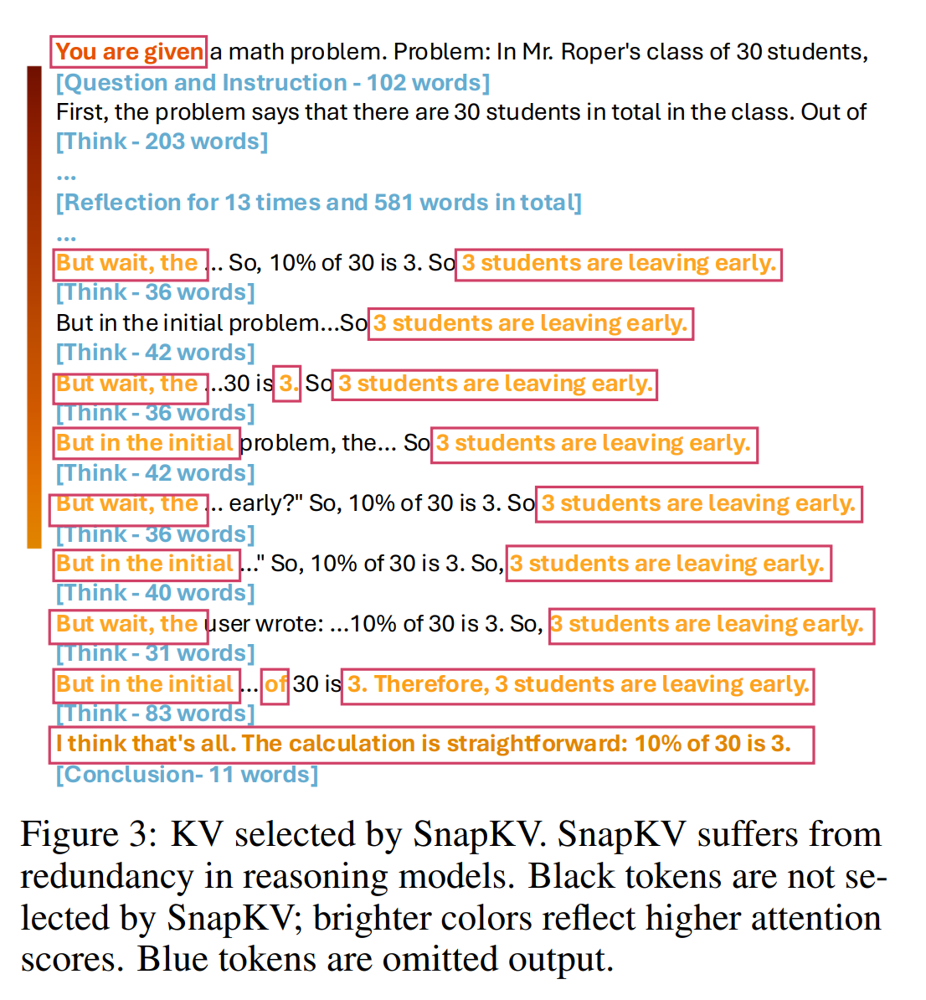

### Algorithm-system co-design

#### Layer-adaptive cache management
1. What if different layers have differnet cache arrangement

- H2O: Heavy-Hitter Oracle for Efficient Generative
Inference of Large Language Models
**accumulated attention score**

https://arxiv.org/pdf/2306.14048

- SnapKV: LLM Knows What You are Looking for
Before Generation
**pooling attention score**

https://arxiv.org/pdf/2404.14469

- R-KV: Redundancy-aware KV Cache Compression for
Reasoning Models
**KV similarity**

https://arxiv.org/pdf/2505.24133

##### Observation/Requirements
1. Different layer should have differnet kv metadata.
2. Differnet layer should have different budgets
3. Differnet head could have different metadata/budgets

https://arxiv.org/pdf/2407.11550

#### How much cost should we spend on supporting these methods?

30 token/s $\Rightarrow$ 130 token/s $\Rightarrow$ 40 token/s

Can we make them faster?
1. custom kernel for handling cudagraph
make existing metadata handling part of graph
2. piecewise cudagraph 
https://github.com/sgl-project/sglang/pull/10062

TODO 1: support these algorithm in https://github.com/Zefan-Cai/KVCache-Factory
TODO 2: make layer-wise KV cache handling faster

(possible application in dLLM, with more complicated KV cache arrangement)