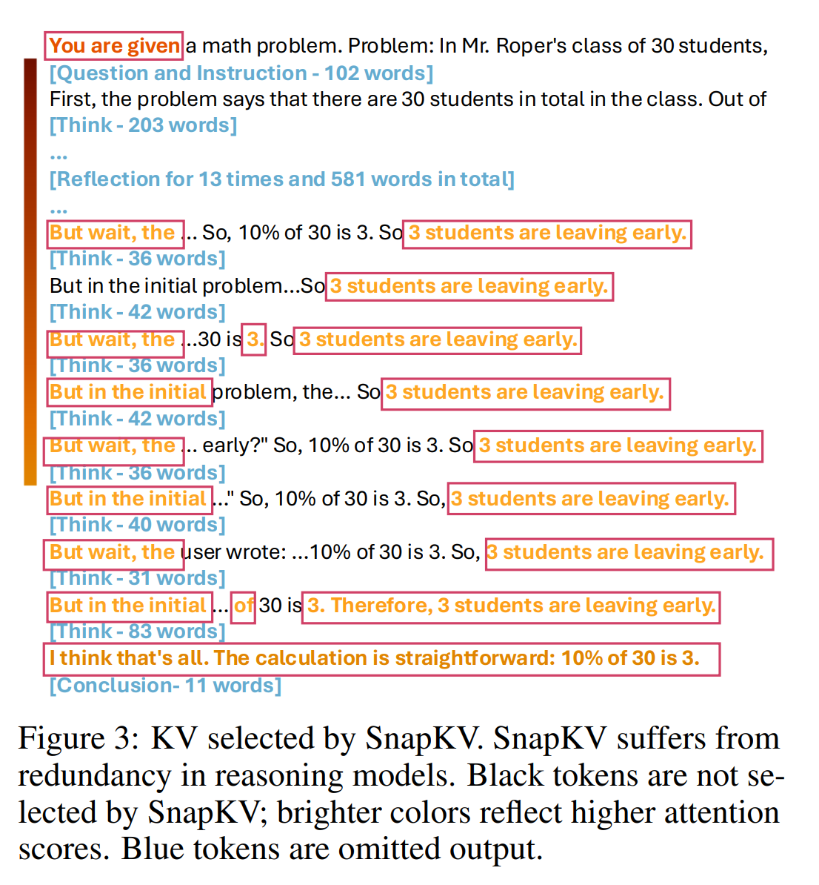
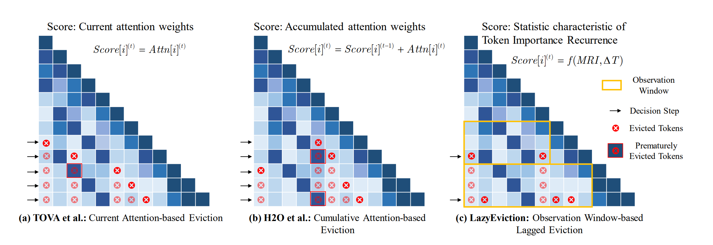
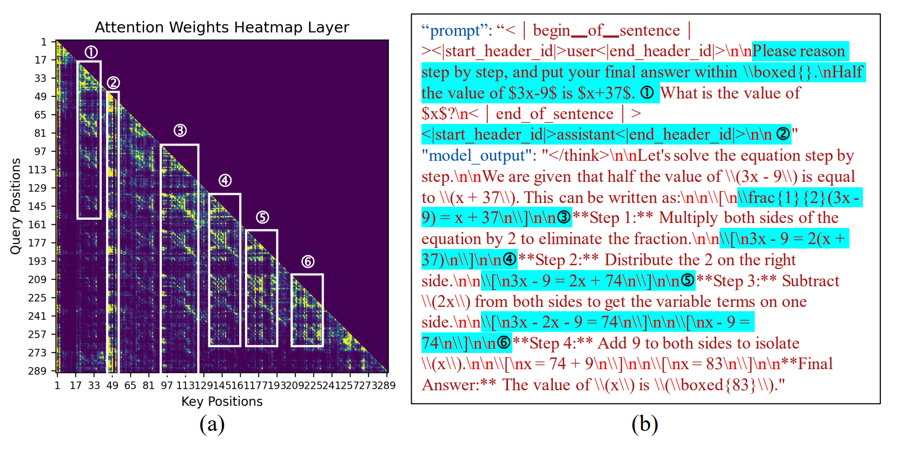
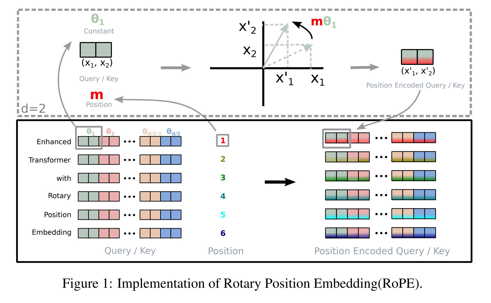

#### Related work
- R-KV: Redundancy-aware KV Cache Compression for
Reasoning Models
**KV similarity**

https://arxiv.org/pdf/2505.24133

- LazyEviction: Lagged KV Eviction with Attention Pattern Observation for
Efficient Long Reasoning

https://arxiv.org/pdf/2506.15969
 

- TableKV: KV Cache Compression for In-Context Table Processing

https://openreview.net/pdf?id=ahpSVDahoH

#### Structure-aware KV compression

##### RoPE

##### Calculating angle between existing tokens

